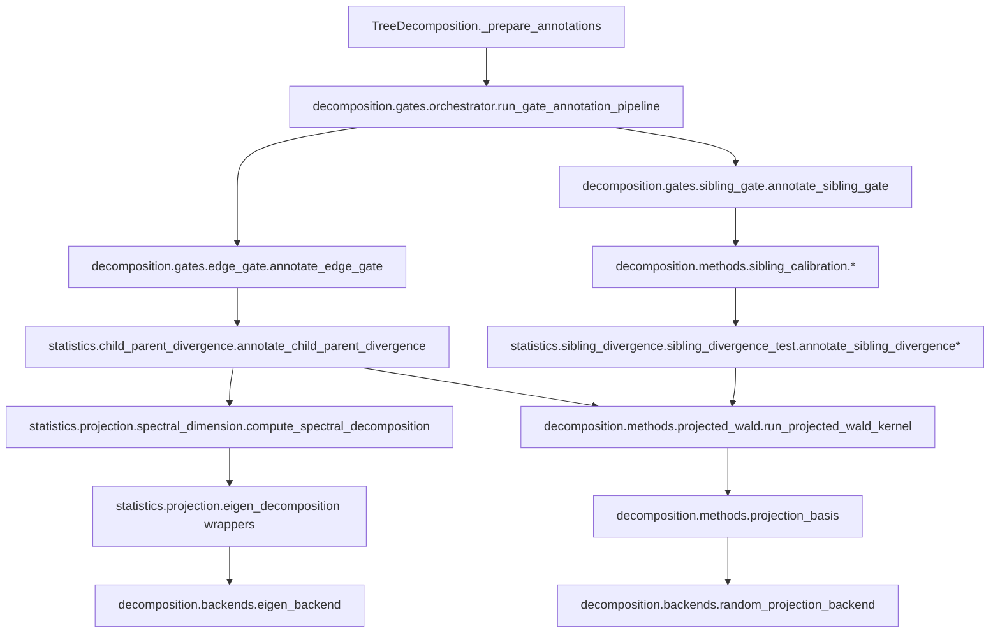

# Decomposition Method Maps

Updated: 2026-03-04

This document maps the current decomposition architecture after the gate-adapter/orchestrator refactor and Step 10 cleanup.

## 1) Canonical Runtime Wiring



## 2) Directly Wired Methods (Precise Names)

| Concern | Canonical method/function | Selected by |
| --- | --- | --- |
| Gate 2 k-estimation | `effective_rank`, `marchenko_pastur`, `active_features` in `decomposition.methods.k_estimators` | `config.SPECTRAL_METHOD` |
| Gate 2 projection basis | `build_pca_projection_basis`, `build_projection_basis_with_padding`, `build_random_orthonormal_basis` in `decomposition.methods.projection_basis` | Spectral availability at each node |
| Shared projected test kernel | `run_projected_wald_kernel` in `decomposition.methods.projected_wald` | Called by edge and sibling tests |
| Sibling calibration controller | `resolve_sibling_calibrator` in `decomposition.core.registry` -> `decomposition.methods.sibling_calibration.*` | `config.SIBLING_TEST_METHOD` |
| Eigendecomposition backend | `eigendecompose_correlation_backend`, `build_pca_projection_backend` in `decomposition.backends.eigen_backend` | Internal to spectral decomposition path |
| Random/JL backend | `compute_projection_dimension_backend`, `generate_projection_matrix_backend`, `derive_projection_seed_backend` in `decomposition.backends.random_projection_backend` | Fallback and sibling projection path |

Not directly wired: SVD, Schur, Jordan, generalized eigen, Fourier.

## 3) Compatibility Shims Retained

| Legacy entrypoint | Canonical target | Status |
| --- | --- | --- |
| `hierarchy_analysis.gate_annotations.compute_gate_annotations` | `decomposition.gates.orchestrator.run_gate_annotation_pipeline` | Kept with `DeprecationWarning` |
| `hierarchy_analysis.gate_annotations.annotate_edge_gate` | `decomposition.gates.edge_gate.annotate_edge_gate` | Kept with `DeprecationWarning` |
| `hierarchy_analysis.gate_annotations.annotate_sibling_gate` | `decomposition.gates.sibling_gate.annotate_sibling_gate` | Kept with `DeprecationWarning` |
| `statistics.projection.eigen_decomposition.*` | `decomposition.backends.eigen_backend.*` | Kept as thin wrappers |
| `statistics.projection.random_projection.*` | `decomposition.backends.random_projection_backend.*` | Kept as thin wrappers |
| `statistics.projection.estimators.*` | `decomposition.methods.k_estimators.*` | Kept as thin wrappers |

## 4) Simplified Dependency Graph

```text
TreeDecomposition
  -> decomposition.gates.orchestrator
     -> decomposition.gates.{edge_gate,sibling_gate}
        -> child_parent_divergence / sibling_divergence_test
           -> decomposition.methods.projected_wald
              -> decomposition.methods.projection_basis
                 -> decomposition.backends.{eigen_backend, random_projection_backend}
        -> spectral_dimension
           -> decomposition.backends.eigen_backend
  -> decomposition.gates.traversal (GateEvaluator + worklist traversal)
  -> decomposition.gates.pairwise_testing (post-hoc pair tests)
  -> decomposition.gates.posthoc_merge (merge policy)
```

## 5) Cleanup Outcome

1. Canonical implementations are now in `decomposition/{core,methods,gates,backends}`.
2. Legacy modules remain as wrappers only where external import stability is needed.
3. The backend layer no longer depends on legacy estimator internals.
