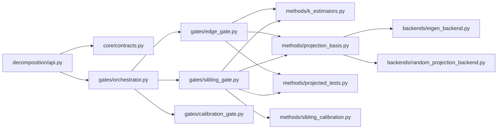

# Decomposition Method Maps

Updated: 2026-03-04

This document maps how decomposition methods are wired in the current pipeline and proposes a modular target layout for the next refactor cycle.

## 1) Current Wiring (As Implemented)

```mermaid
flowchart TD
    TD[TreeDecomposition.__init__] --> GA[compute_gate_annotations]

    GA --> G2[Gate 2: annotate_child_parent_divergence]
    GA --> G3[Gate 3: annotate_sibling_divergence_*]

    G2 --> SD[compute_spectral_decomposition]
    SD --> EK[estimate_spectral_k]
    EK --> ER[effective_rank (default)]
    EK --> MP[marchenko_pastur]
    EK --> AF[active_features]

    SD --> ED[eigendecompose_correlation]
    ED --> DUAL[np.linalg.eigh/eigvalsh on dual Gram]
    ED --> PRIMAL[np.linalg.eigh/eigvalsh on corr matrix]
    SD --> PCA[build_pca_projection + eigenvalues]

    G2 --> PT[_compute_projected_test]
    PT --> PP[compute_projected_pvalue]
    PT --> RP[JL fallback: compute_projection_dimension + generate_projection_matrix]

    G3 --> CW[cousin_weighted_wald (default)]
    CW --> SDT[sibling_divergence_test]
    SDT --> RP2[compute_projection_dimension + generate_projection_matrix]
    SDT --> PP2[compute_projected_pvalue]
```

## 2) Directly Wired Methods by Gate

| Gate                  | Method family                                                           | Current status                                 | Where selected                                               |
| --------------------- | ----------------------------------------------------------------------- | ---------------------------------------------- | ------------------------------------------------------------ |
| Gate 2 (child-parent) | `effective_rank` spectral k                                             | Default active                                 | `config.SPECTRAL_METHOD`                                     |
| Gate 2 (child-parent) | `marchenko_pastur` spectral k                                           | Optional active                                | `config.SPECTRAL_METHOD`                                     |
| Gate 2 (child-parent) | `active_features` k                                                     | Optional active                                | `config.SPECTRAL_METHOD`                                     |
| Gate 2 (child-parent) | Correlation eigendecomposition (primal/dual)                            | Active for `effective_rank`/`marchenko_pastur` | `projection/eigen_decomposition.py`                          |
| Gate 2 (child-parent) | PCA projection + optional whitening/Satterthwaite                       | Active when PCA basis exists                   | `projection/satterthwaite.py`                                |
| Gate 2 (child-parent) | JL/random orthonormal projection                                        | Fallback (or full path if no spectral info)    | `projection/random_projection.py`                            |
| Gate 3 (sibling)      | JL/random orthonormal projection                                        | Default active path                            | `gate_annotations.py` forces sibling spectral args to `None` |
| Gate 3 (sibling)      | `cousin_weighted_wald`                                                  | Default sibling test controller                | `config.SIBLING_TEST_METHOD`                                 |
| Gate 3 (sibling)      | `cousin_adjusted_wald` / `cousin_ftest` / `cousin_tree_guided` / `wald` | Optional alternatives                          | `config.SIBLING_TEST_METHOD`                                 |

Not directly wired today: SVD, Schur, Jordan, generalized eigen, Fourier.

## 3) Target Modularization Map



### Suggested module responsibilities

- `core/contracts.py`: `ProblemSpec`, `GateContext`, `ProjectionSpec`, `TestResult`.
- `methods/k_estimators.py`: `effective_rank`, `marchenko_pastur`, `active_features`.
- `methods/projection_basis.py`: choose PCA basis vs random basis and padding policy.
- `methods/projected_tests.py`: projected Wald statistic + p-value path (whitened/Satterthwaite).
- `methods/sibling_calibration.py`: cousin-weighted/adjusted/tree-guided calibration logic.
- `gates/*.py`: gate-specific orchestration only, no low-level linear algebra.
- `backends/*.py`: numerical kernels (`np.linalg.eigh`, QR projection, cache policy).

## 4) Migration Map (Current -> Target)

| Current function/file                                           | Target module                                             | Migration note                                                                             |
| --------------------------------------------------------------- | --------------------------------------------------------- | ------------------------------------------------------------------------------------------ |
| `tree_decomposition.py::TreeDecomposition._prepare_annotations` | `gates/orchestrator.py`                                   | Keep orchestration only; remove statistical internals.                                     |
| `gate_annotations.py::compute_gate_annotations`                 | `gates/orchestrator.py`                                   | Split gate sequencing from method selection.                                               |
| `edge_significance.py::_compute_projected_test`                 | `methods/projected_tests.py`                              | Single shared projected-test implementation for both gates.                                |
| `edge_significance.py::annotate_child_parent_divergence`        | `gates/edge_gate.py`                                      | Keep edge traversal and assignment only.                                                   |
| `sibling_divergence_test.py::sibling_divergence_test`           | `methods/projected_tests.py` + `gates/sibling_gate.py`    | Reuse projected core; keep sibling-specific z construction in sibling gate.                |
| `projection/spectral_dimension.py`                              | `methods/k_estimators.py` + `methods/projection_basis.py` | Keep per-node decomposition orchestration but separate estimators from basis construction. |
| `projection/eigen_decomposition.py`                             | `backends/eigen_backend.py`                               | Backend-only; no gate semantics.                                                           |
| `projection/random_projection.py`                               | `backends/random_projection_backend.py`                   | Backend-only; shared by gates.                                                             |
| `sibling_divergence/cousin_*.py`                                | `methods/sibling_calibration.py`                          | Unify calibration model contracts and prediction entrypoints.                              |

## 5) Refactor Sequence

1. Extract shared `projected_tests.py` and switch both Gate 2 and Gate 3 to it.
2. Extract `projection_basis.py` (PCA/random/padding policy) with one API.
3. Move estimators into `k_estimators.py` and keep spectral decomposition as composition.
4. Move gate orchestration into `gates/edge_gate.py` and `gates/sibling_gate.py`.
5. Move numerical kernels into `backends/` and keep gates method-agnostic.

