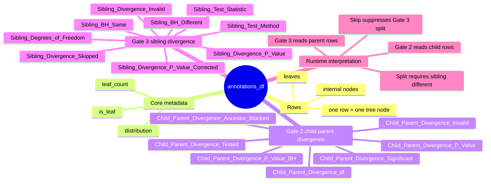

# annotations_df

This document describes the schema and runtime meaning of `annotations_df`, the node-indexed dataframe used by the hierarchy decomposition pipeline.

## What It Is

`annotations_df` is a table keyed by tree node ID.

- Each row represents one tree node.
- Each column represents one annotation or test result for that node.
- The dataframe is progressively populated as the pipeline runs:
  - core node metadata first
  - Gate 2 child-parent divergence results next
  - Gate 3 sibling divergence results last

`annotations_df.attrs` stores auxiliary diagnostics and spectral artifacts, but those are metadata fields, not dataframe columns.

## Row Semantics

Every row is a single node in the hierarchy.

- Leaf rows represent observed terminal samples/items.
- Internal-node rows represent candidate split points in the decomposition.

Runtime interpretation is asymmetric:

- Gate 2 writes and reads edge-test results on child rows.
- Gate 3 writes and reads sibling-test results on parent rows.

## Column Groups

### Core node metadata

| Column | Purpose |
| --- | --- |
| `distribution` | The node's probability distribution or feature profile used by the statistical tests. |
| `leaf_count` | Number of descendant leaves under the node; effectively the node sample size. |
| `is_leaf` | Whether the row represents a leaf node rather than an internal split candidate. |

### Gate 2: child-parent divergence

These columns are associated with a parent→child edge test, but the result is stored on the child row.

| Column | Purpose |
| --- | --- |
| `Child_Parent_Divergence_P_Value` | Raw p-value for the child-vs-parent divergence test. |
| `Child_Parent_Divergence_P_Value_BH` | Multiple-testing-corrected edge p-value. With `tree_bh`, blocked descendants may remain `NaN`. |
| `Child_Parent_Divergence_Significant` | Gate 2 decision flag. `True` means the child is treated as significantly different from its parent. |
| `Child_Parent_Divergence_df` | Effective degrees of freedom used by the projected edge test. |
| `Child_Parent_Divergence_Invalid` | Marks numerically invalid edge tests routed through the conservative fallback path. |
| `Child_Parent_Divergence_Tested` | Whether this edge was actually tested by the multiple-testing procedure. |
| `Child_Parent_Divergence_Ancestor_Blocked` | `True` when hierarchical FDR skipped this edge because an ancestor family already failed. |

### Gate 3: sibling divergence

These columns are associated with a sibling-pair test, and the result is stored on the parent row.

| Column | Purpose |
| --- | --- |
| `Sibling_Divergence_Skipped` | Sibling test was not run for this node, usually because the node is a leaf or not binary. |
| `Sibling_Test_Statistic` | Raw sibling divergence test statistic. |
| `Sibling_Degrees_of_Freedom` | Effective degrees of freedom used by the sibling test. |
| `Sibling_Divergence_P_Value` | Raw p-value for the sibling divergence test. |
| `Sibling_Divergence_P_Value_Corrected` | Corrected p-value for the sibling test. |
| `Sibling_Divergence_Invalid` | Marks invalid sibling tests routed through the conservative fallback path. |
| `Sibling_BH_Different` | Gate 3 split flag. `True` means siblings are treated as significantly different, so decomposition may split here. |
| `Sibling_BH_Same` | Complementary merge-oriented flag. `True` means the sibling test did not support a split. |
| `Sibling_Test_Method` | Optional label for the sibling-testing backend that produced the result. |

## How The Decomposer Uses It

At runtime, the decomposer effectively asks three questions:

1. Is the current parent binary?
2. Does at least one child show significant child-parent divergence?
3. Are the siblings significantly different from each other?

That translates into these columns:

- Gate 2 uses `Child_Parent_Divergence_Significant` on child rows.
- Gate 3 uses `Sibling_BH_Different` and `Sibling_Divergence_Skipped` on parent rows.

In practice:

- if Gate 2 is closed, the node merges
- if Gate 2 is open and Gate 3 is open, the node splits
- if Gate 3 is skipped, the node does not split at that level

## Quick Read Guide

- If you want node metadata:
  read `distribution`, `leaf_count`, `is_leaf`.
- If you want edge-level evidence:
  read `Child_Parent_*` on child rows.
- If you want sibling-split evidence:
  read `Sibling_*` on parent rows.
- If you want runtime split decisions:
  focus on `Child_Parent_Divergence_Significant`, `Sibling_BH_Different`, and `Sibling_Divergence_Skipped`.

## Mindmap

