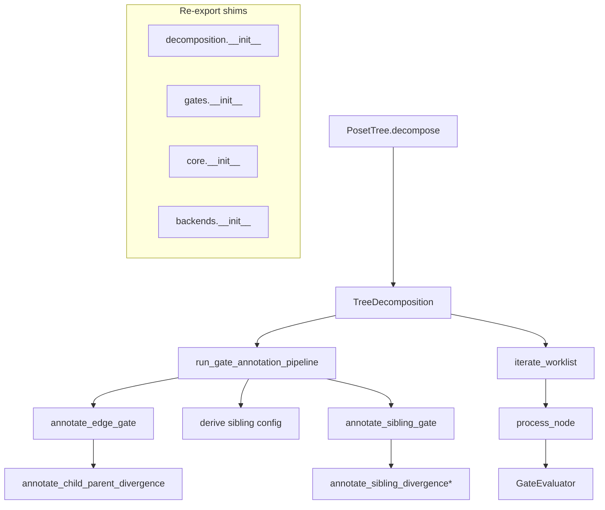

# Wrapper And Shim Map

This document maps wrapper and shim layers in the `hierarchy_analysis` decomposition stack that appear unnecessary within this repository.

Scope:

- In-repo usage only
- Focused on `hierarchy_analysis/decomposition` and the immediate tree facade around it
- "Unnecessary" means the wrapper adds little or no behavioral value beyond forwarding, re-exporting, or packaging metadata that no production caller in this repo consumes directly

## Executive Summary

The main removable indirection is concentrated in the decomposition stack:

1. Gate 2 wrapper
2. Gate 3 wrapper
3. Package-level re-export modules
4. Tiny traversal helper layer
5. One convenience tree shim

The largest cleanup win is to collapse:

- `edge_gate.py`
- `sibling_gate.py`
- parts of `traversal.py`

into:

- `orchestrator.py`
- `tree_decomposition.py`

## Current Call Map



## Unnecessary Wrapper/Shim Candidates

| File | Kind | Why it looks unnecessary | In-repo usage | Suggested collapse target |
| --- | --- | --- | --- | --- |
| `decomposition/gates/edge_gate.py` | Wrapper | Mostly forwards args to `annotate_child_parent_divergence()`, validates columns, then packages a bundle. No independent policy beyond that. | Called from `orchestrator.py`; directly referenced by one parity test. | Inline into `run_gate_annotation_pipeline()` or return raw dataframe + metadata helper. |
| `decomposition/gates/sibling_gate.py` | Wrapper | Mostly dispatches on `sibling_method`, validates columns, then packages a bundle. The dispatch table could live in the orchestrator or in the sibling statistics package. | Called from `orchestrator.py`; directly referenced by one parity test. | Inline into `run_gate_annotation_pipeline()` or move method registry next to sibling annotators. |
| `decomposition/gates/traversal.py` | Shim/helper split | `process_node()` and `iterate_worklist()` are tiny and only make sense together with `TreeDecomposition` and `GateEvaluator`. The module also re-exports `GateEvaluator` purely for backward compatibility. | Used by `tree_decomposition.py`; heavily unit-tested directly. | Inline both helpers into `TreeDecomposition.decompose_tree()` and remove the `GateEvaluator` re-export. |
| `decomposition/gates/__init__.py` | Re-export shim | Pure export surface; no in-repo imports rely on it. | No in-repo consumers found. | Remove or keep only if external API stability matters. |
| `decomposition/__init__.py` | Re-export shim | Pure export surface for contracts. No production call sites in repo. | No in-repo consumers found. | Remove or fold exports into direct imports from `core.contracts`. |
| `decomposition/core/__init__.py` | Re-export shim | Pure export surface; direct module imports are already used instead. | No in-repo consumers found. | Remove if package-level import ergonomics are not required. |
| `decomposition/backends/__init__.py` | Re-export shim | Pure export surface. In repo, it is only used by a parity test. | One test import; no production imports found. | Remove and import backend functions from concrete modules directly. |
| `tree/poset_tree.py::build_sample_cluster_assignments()` | Convenience shim | Direct one-line pass-through to `hierarchy_analysis.cluster_assignments.build_sample_cluster_assignments()`. | Used in tests; scripts also call the function directly. | Remove if method-style ergonomics are not needed. |

## Not Unnecessary, Even If Thin

These are facades, but they still carry real value in this repo.

### `tree/poset_tree.py::decompose()`

Keep.

Why:

- It is the dominant public entrypoint across benchmarks, scripts, and tests.
- It owns fallback behavior around `self.annotations_df` and `leaf_data`.
- Removing it would push callers into manual `TreeDecomposition(...)` construction everywhere.

### `decomposition/gates/orchestrator.py::run_gate_annotation_pipeline()`

Keep the concept, but simplify its internals.

Why:

- It is the actual composition point for Gate 2, sibling-config derivation, and Gate 3.
- `TreeDecomposition._prepare_annotations()` uses it directly.
- Tests also exercise it as the canonical pipeline seam.

Recommendation:

- keep `run_gate_annotation_pipeline()`
- inline `annotate_edge_gate()` and `annotate_sibling_gate()` into it

## Detailed Notes

### 1. `edge_gate.py`

Current behavior:

- forwards to `annotate_child_parent_divergence()`
- validates edge columns
- captures sibling column names if already present
- returns `GateAnnotationBundle`

Why removable:

- the file does not encode unique edge-gate policy
- the validation step can be a helper call from the orchestrator
- `GateAnnotationBundle` is used mostly as a transport object for orchestrator/tests

### 2. `sibling_gate.py`

Current behavior:

- dispatches by string to one of three sibling annotators
- validates edge and sibling columns
- returns `GateAnnotationBundle`

Why removable:

- the dispatch table is short and local
- the function adds almost no abstraction over the underlying annotators
- the caller already knows it is running Gate 3

### 3. `traversal.py`

Current behavior:

- `iterate_worklist()` wraps a four-line DFS pop/skip/yield loop
- `process_node()` wraps the node decision tree
- re-exports `GateEvaluator`

Why removable:

- this is decomposition control flow, not reusable domain logic
- the helper functions expose `GateEvaluator` internals like `_children_map` and `_descendant_leaf_sets`
- testing them directly increases coupling to micro-structure rather than behavior

### 4. Package `__init__` re-export shims

Files:

- `decomposition/__init__.py`
- `decomposition/gates/__init__.py`
- `decomposition/core/__init__.py`
- `decomposition/backends/__init__.py`

Why removable:

- no in-repo production imports depend on these surfaces
- they mostly duplicate concrete module exports
- they expand the apparent public API without adding behavior

### 5. `PosetTree.build_sample_cluster_assignments()`

Current behavior:

- one-line method that forwards to the standalone function

Why removable:

- the standalone function is already imported and called directly elsewhere
- it adds an extra access path for the same behavior

Why it is less urgent than the gate wrappers:

- it is harmless
- it improves discoverability for `PosetTree` users

## Lowest-Risk Simplification Plan

1. Inline `annotate_edge_gate()` into `run_gate_annotation_pipeline()`.
2. Inline `annotate_sibling_gate()` into `run_gate_annotation_pipeline()`.
3. Keep `GateAnnotationBundle` only if tests or external callers truly need structured metadata; otherwise return the dataframe plus an optional metadata dict.
4. Inline `iterate_worklist()` and `process_node()` into `TreeDecomposition.decompose_tree()`.
5. Remove unused package-level `__init__` re-export surfaces.
6. Decide separately whether `PosetTree.build_sample_cluster_assignments()` is worth keeping for ergonomics.

## Practical End State

The decomposition path could become:

```text
PosetTree.decompose()
  -> TreeDecomposition(...)
  -> _prepare_annotations()
  -> run_gate_annotation_pipeline()
       -> annotate_child_parent_divergence()
       -> derive sibling config
       -> sibling annotator dispatch
  -> decompose_tree()
```

instead of:

```text
PosetTree.decompose()
  -> TreeDecomposition(...)
  -> _prepare_annotations()
  -> run_gate_annotation_pipeline()
       -> annotate_edge_gate()
            -> annotate_child_parent_divergence()
       -> annotate_sibling_gate()
            -> sibling annotator dispatch
  -> iterate_worklist()
  -> process_node()
```

## Evidence Notes

This map is based on in-repo import and call-site inspection. In particular:

- no in-repo consumers were found for:
  - `decomposition/__init__.py`
  - `decomposition/gates/__init__.py`
  - `decomposition/core/__init__.py`
- `decomposition/backends/__init__.py` is used by a test import but not by production code in this repo
- `edge_gate.py` and `sibling_gate.py` are primarily exercised through orchestrator tests rather than independent production call paths
